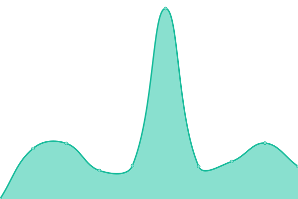
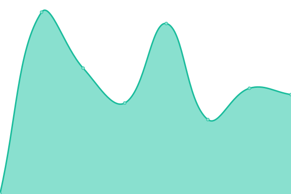

# [📈 Live Status](https://py.kitsu-team.dev): <!--live status--> **🟥 Complete outage**

This repository contains the open-source uptime monitor and status page for [PyWhy](https://kitsu-team.dev/), powered by [Upptime](https://github.com/upptime/upptime).

With [Upptime](https://upptime.js.org), you can get your own unlimited and free uptime monitor and status page, powered entirely by a GitHub repository. We use [Issues](https://github.com/PyWhy-3275/upptime/issues) as incident reports, [Actions](https://github.com/PyWhy-3275/upptime/actions) as uptime monitors, and [Pages](https://py.kitsu-team.dev) for the status page.

<!--start: status pages-->
<!-- This summary is generated by Upptime (https://github.com/upptime/upptime) -->
<!-- Do not edit this manually, your changes will be overwritten -->
<!-- prettier-ignore -->
| URL | Status | History | Response Time | Uptime |
| --- | ------ | ------- | ------------- | ------ |
|  [Factorycraft Site](https://site.factorycraft.cf) | 🟥 Down | [factorycraft-site.yml](https://github.com/PyWhy-3275/upptime/commits/HEAD/history/factorycraft-site.yml) | 

 2495ms
     
 | 

<a href="https://py.kitsu-team.dev/history/factorycraft-site">82.34%</a>
    

|  [Factorycraft Forum](https://factorycraft.cf) | 🟥 Down | [factorycraft-forum.yml](https://github.com/PyWhy-3275/upptime/commits/HEAD/history/factorycraft-forum.yml) | 

 1281ms
     
 | 

<a href="https://py.kitsu-team.dev/history/factorycraft-forum">82.35%</a>
    

|  Launcher API | 🟥 Down | [launcher-api.yml](https://github.com/PyWhy-3275/upptime/commits/HEAD/history/launcher-api.yml) | 

 2826ms
     
 | 

<a href="https://py.kitsu-team.dev/history/launcher-api">43.96%</a>
    

|  [HardCraft](ip.kitsu-team.dev) | 🟥 Down | [hard-craft.yml](https://github.com/PyWhy-3275/upptime/commits/HEAD/history/hard-craft.yml) | 

 317ms
     
 | 

<a href="https://py.kitsu-team.dev/history/hard-craft">30.69%</a>
    

<!--end: status pages-->

[**Visit our status website →**](https://py.kitsu-team.dev)

## 📄 License

- Powered by: [Upptime](https://github.com/upptime/upptime)
- Code: [MIT](./LICENSE) © [PyWhy](https://kitsu-team.dev/)
- Data in the `./history` directory: [Open Database License](https://opendatacommons.org/licenses/odbl/1-0/)
